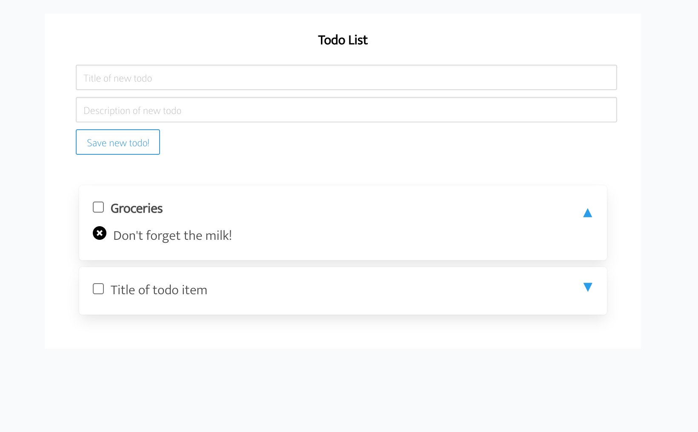

# Todo app

This Todo app is a React app to keep track of your todo's.

## Local development

### Backend

The app is based on a fastAPI backend and can be started as follows:

```
git clone https://github.com/daanbeverdam/TodoList-FastAPI 
cd TodoList-FastAPI
docker-compose up
```

### Frontend

The React frontend can be started with:

```
npm install
npm start
```

Open http://localhost:3000/ to see your app.


## Preview

### Screenshot


